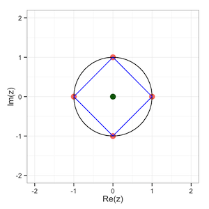

Binomic Equation Calculator
========================================================
author: A. Stoica
date: January 25th, 2015

***


About the application
========================================================

We have developed an application that solves binomic equations. Binomic equations appear in many fields of mathematics such as number theory and the discrete Fourier transform. The solutions of such equations generalize the notion of "root of unity". 

A binomic equation is an equation of the form $(z-c)^n = A$, where $n$ is a natural number, and $z, c,$ and $A$ are complex numbers. Here $n, c,$ and $A$ are given and $z$ is the unknown.

The application is available at *http://tralalilu.shinyapps.io/binomic/*.

The code for the application and this presentation can be downloaded from *http://github.com/tralalilu/Developing-Data-Products*. 


Application's structure
==========

The application consists of three tabs:

- **Solution**: the left column of this tab contains 5 textboxes to input the data (one for the degree of the equation, $n$, and four for the real and imaginary parts of the complex numbers $c$ and $A$, respectively) and two buttons, *Solve* and *Plot*. The main part of this tab shows reactively the data input by the user. Pressing the *Solve* button prints a data frame with the real and imaginary part of the solutions of the binomic equation $(z-c)^n = A$. 
- **Plot**: this tab contains a plot of the solutions of the previous equation and it is available after the *Plot* button (in the first tab) has been pressed.
- **About**: this final tab contains the necessary documentation to better understand and run the application.

The code for this application is available here: 
* *.

ui.R and server.R
========================================================

The application consists of three files: **ui.R**, **server.R** and **README.md** (contains the documentation of the application). 

- In the **ui.R** file we use the *navbarPage()* function to create different tabs for the application. We also use the functions *numericInput()*, *textInput()* and *actionButton()* to input the data. The output is printed using the functions *verbatimTextOutput()*, *tableOutput()* and *plotOutput()*. 

- The core of the application lies in the two functions *solve()* and *draw()* in the **server.R** file. The *solve()* function takes the input data, computes the modulus and the argument of $A$, and then constructs the solutions of the equation and returns them as a data frame. The *draw()* function takes the input data and, using the newly created data frame, plots the solutions. 


Example
========================================================

By applying the *solve()* function to the following input data

```r
n <- 4; rec <- 0; imc <- 0; reA <- 1;imA <- 0
```

we obtain


```
   z Re(z) Im(z)
1 z0     1     0
2 z1     0     1
3 z2    -1     0
4 z3     0    -1
```

These numbers, $\pm 1$ and $\pm i$, are exactly the $4$^th roots of unity, i.e. the complex numbers $z$ such that $z^4 = 1$.

